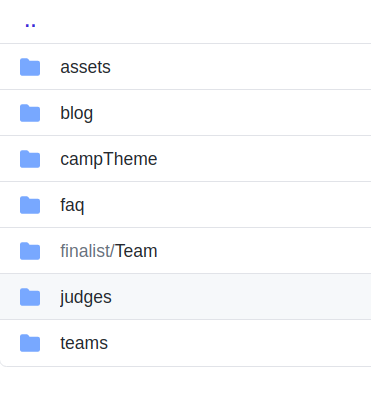
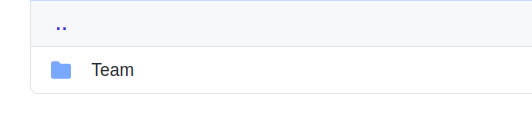

**Hey Devs ! Happy to see you in as a finalist**

# Making Finalist Pull Request.

The step for making finalist pull request is to be followed strictly. and If the finalist will not make in time, this would lead to their disqualification. So be ready !


* Go to the previously forked repository of yours. **The Repository name is CODE-CAMP-2020**.

* Go to `Content/finalist` Folder. 



* Now Inside the finalist folder you will see `Team` folder like below



* Now Make a `New Folder` below `Team's folder`. Name of the `New Folder` will be your team name as mentioned in registration Pull Request and inside that folder `index.md` file should be there.

* Inside the `index.md` file. please copy following Template Exactly.

```
---
type: "finalist"                   
title: 
name: ""
description: ""
Team-Quote: ""
Application_Type: ""
---

Team Introduction will go here.

---

# Project's Name

_**Theme-Name**_ : 

_**Application-Type**_ :   

---

# Description

> The description will go here and it should be Short and descriptive. (limit 150)


---

_**Tech-Stack**_  :   

_**GitHub-Link**_ :   

_**Hosted-Link**_ :   


---


# Leader's Name

_**Role-In-Team**_  : 

_**Working-Stack**_ : 

_**University/School**_ :


# Member1 Name

_**Role-In-Team**_  : 

_**Working-Stack**_ : 

_**University/School**_ :


# Member2 Name

_**Role-In-Team**_  : 

_**Working-Stack**_ : 

_**University/School**_ :


# Member3 Name

_**Role-In-Team**_  : 

_**Working-Stack**_ : 

_**University/School**_ :


# Member4 Name

_**Role-In-Team**_  : 

_**Working-Stack**_ : 

_**University/School**_ :


(Extend the members as per your team's Size)
```

## Now Commiting Changes


# Warning

> # No Pull Request will be Entertained after 10:00 PM.

> # Submission for finalist Starts On 27th july, 2020 from 10:00 AM to 10:00 PM
