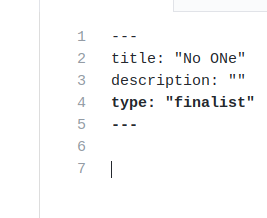
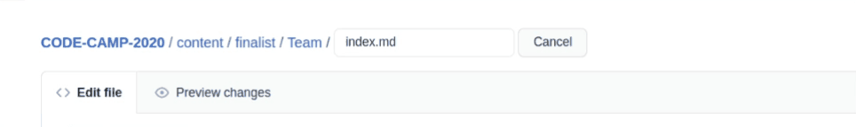

**Hey Devs ! Happy to see everyone clearing the first Evaluation Round. And now it's the time to fasten your seat belts and get ready for Second Evaluation Round.**

# Making Finalist Pull Request.

The step for making finalist pull request is to be followed strictly. and If the finalist will not make in time, this would lead to their disqualification. So be ready !


* Go to the previously forked repository of yours. **The Repository name is CODE-CAMP-2020**.

* Go to `Content/finalist` Folder. 


* Now Inside the finalist folder you will see `Team` folder like below


* Kindly head in to `Team/index.md`. And after opening `index.md` at the top right corner, Edit the file `index.md`.


* And Now `Delete` the Pre-Existing Text in there.



* After `Deleting` Pre-Existing text. Replace it with the following Template.

```
---
type: "finalist"                   
title: 
name: ""
description: ""
Team-Quote: ""
Application_Type: ""
---

Team Introduction will go here.

---

# Project's Name

_**Theme-Name**_ : 

_**Application-Type**_ :   

---

# Description

> The description will go here and it should be Short and descriptive. (limit 150)


---

_**Tech-Stack**_  :   

_**GitHub-Link**_ :   

_**Hosted-Link**_ :   


---


# Leader's Name

_**Role-In-Team**_  : 

_**Working-Stack**_ : 

_**University/School**_ :


# Member1 Name

_**Role-In-Team**_  : 

_**Working-Stack**_ : 

_**University/School**_ :


# Member2 Name

_**Role-In-Team**_  : 

_**Working-Stack**_ : 

_**University/School**_ :


# Member3 Name

_**Role-In-Team**_  : 

_**Working-Stack**_ : 

_**University/School**_ :


# Member4 Name

_**Role-In-Team**_  : 

_**Working-Stack**_ : 

_**University/School**_ :


(Extend the members as per your team's Size)
```

## Renaming the Team's Folder

* After adding the details for the finalist. Rename the teams folder as instructed below.



## Now Commiting Changes


