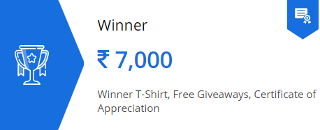
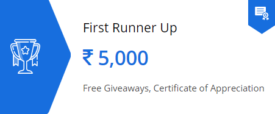
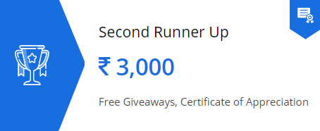
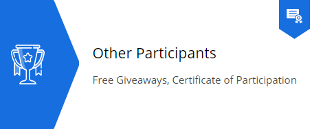

Winners of the hackathon will be honored with prizes and swags. So what are you waiting for send the Pull request now. Visit [CODE-CAMP-2020](https://github.com/ISTESRMNCR/CODE-CAMP-2020).

## Winner 🥇

---

## First Runner Up 🥈

---

## Second Runner Up 🥉

---

## Other Participants

# Other Prizes

### **Proto.io**

 * Team showing best and most interactive prototype will get [Proto.io](https://proto.io) freelancer plan for 1 year.
 * 60-day full featured licenses of [Proto.io](https://proto.io) for all the participants.

### **1Password**

 * Winners to get sign up for 6 months free of a [1Password](https://1password.com/) Individual account.

### **Repl.it**

 * [Repl.it](https://repl.it/) offers 3 free months of our hacker plan to all participants and a year of free hacker to the winners.

### **Balsamiq Cloud**

 * A special 90-day extended trial promo code for the [Balsamiq Cloud](https://balsamiq.cloud/).

### **Rosenfeld**

 * complimentary ebooks for winners.

visit them here [Rosenfeld](https://rosenfeldmedia.com/)