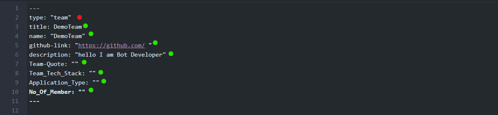
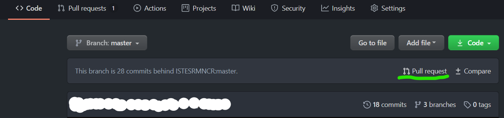
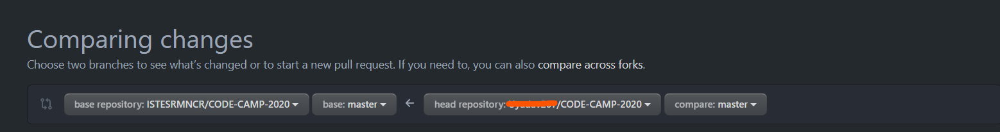

This is how teams going to make the Pull Request for registering to the hackathon CODE CAMP 1.0. so read the instructions carefully.

## Step 1.  **(Forking the Repository and making it yours)**

- Go to [github.com/ISTESRMNCR/CODE-CAMP-2020](https://github.com/ISTESRMNCR/CODE-CAMP-2020/) and fork the repository.

- After forking the repository. you will see that you have got a copy of the repository on your own profile.

- Now you have to do changes on your repository and after that you need to send the pull Request to [ISTESRMNCR/CODE-CAMP-2020]

## Step 2. **(Generating Registration Pull Request)**

**This step will be executed in your Forked Repository**

This step is to be followed very carefully as any mistake can results into your team's rejection.

- Now go to **`content/teams`** folder.
- Here you will see a pre-existing team folder named **`DemoTeam`**.
- Make a copy of **`DemoTeam`** folder and change the name of copied folder by your **`TeamName`**, inside the **`TEAMS`** folder only, not anywhere else. 

> Example : if your team name is **`Helio`** the copied folder name should be **`Helio`**

### Check that the naming convention for your team, It should be 👇

```javaScript
|---- teams
        |---- DemoTeam
        |         |---- index.md
        |
        |---- YourTeam
                  |---- index.md

```

- Now open Your Team's folder that you have just created and you will see something like below.

<p align="center">

</p>

**DO NOT TOUCH THE RED DOTED PART ELSE YOU WILL NOT BE ABLE TO REGISTER**

- You can fill the rest of the information correctly on your own within the given template 

**DO NOT MANIPULATE THE GIVEN TEMPLATE ONLY FILL YOUR DETAILS**

- Now save your changes and Recheck the following: before raising the PULL request.

> - directory which your teaname folder should be in:
**`content/teams/YourTeamName-Folder`** 
> - Inside the team folder there should be a file **`index.md`**
> - Inside **`index.md`** the type should be **`"team"`**
> - Make sure the information is correct. ✅

## Step 3. **(Sending Pull Request)**

> While making Pull request it is recommended to make a branch other than `master` branch and push your changes there.

- Now push your changes in your github repo back again.
- Raise a Pull request.

You will see a option like below. 



- click on the pull request option as demonstrated with green underlining.

Now you will ensure the following should be same: 



The orange underline part should be represented as **`The Pull request sender's GitHub Id name`**

> **THE TITLE OF THE PULL REQUEST WILL BE** **`Registering TEAM [ YourTeamName ]`**

## Step 4. **(Fill the undertaking Pull request)**

- undertaking Pull request template will be given. 
- Fill it completely and recheck it again. **`Before Confirmation`**


### BRAVO! You made it and now your maintainer will check the Pull Request and will ensure your registration.

---

For any information and issue [visit HERE](https://github.com/ISTESRMNCR/CODE-CAMP-2020/issues)
