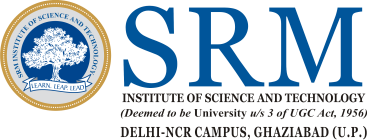

    

Keeping this in mind we proudly present to you I.S.T.E (Indian Society for Technical Education) is a national, professional, non-profit making, government aided society, started in 1941 as the "Association of Principals of Technical Education (A.P.T.I)". With its SRM Chapter's inception in 2007 it has grown to become the only technical society which is government aided in SRM IST. With colleges only focusing on theoretical knowledge and not on what the industry really expects from a professional, ISTE'S main objective is to assist and contribute in the production and development of the professionals in the industry. We conduct many events which targets a particular sets of skills which help in developing general logic, perception and creativity among the students, like workshops for embedded systems, Photo shop, computer languages like C++, Java, HTML, various quizzes, Forums and much more. In a nutshell I.S.T.E has striven to make every student at par with any other professional of that particular field.

**Please Visit our Official Website for Upcoming Events** 

[**https://www.istesrmncr.com**](https://www.istesrmncr.com)