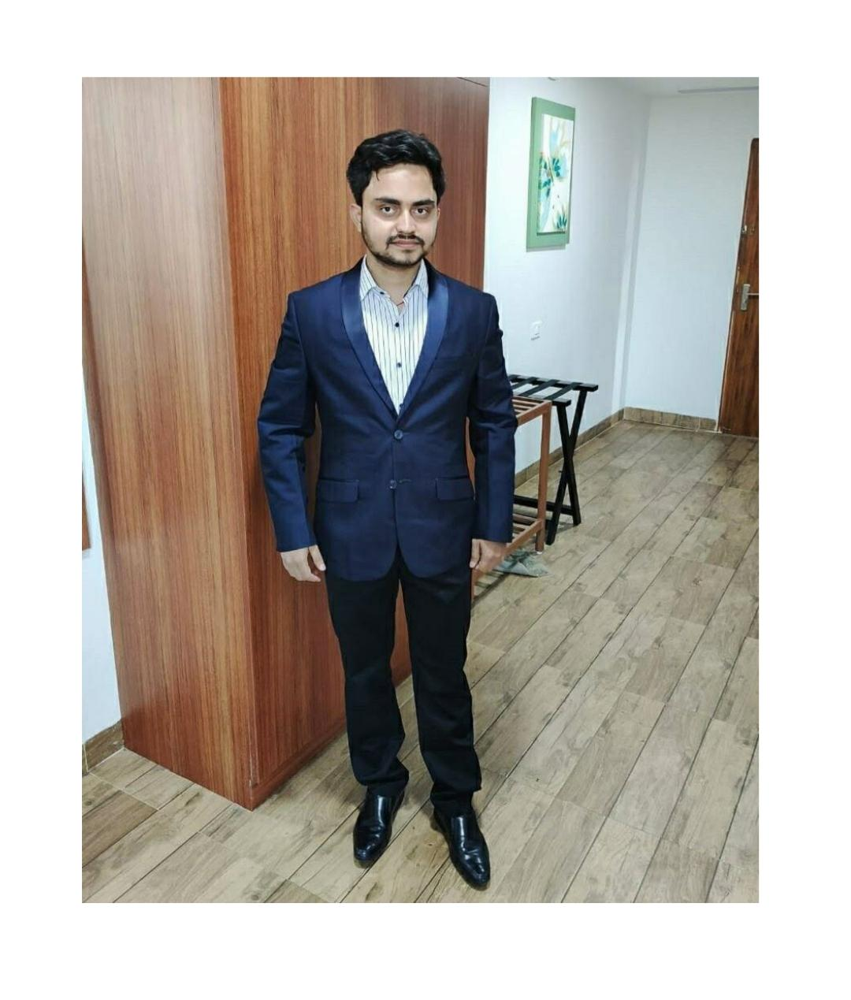

Anamay is a technology enthusiast hailing from Varanasi Uttar Pradesh, fortunate to be the part of redBus India (world's largest online bus ticketing platform) after graduating from SRM Kattankulathur Chennai in 2019. `He Has won few National level Hackathons which include Airbus Aerothon in 2019 and Smart India Hackathon in 2018` organised by Gov. of India along with project deployment under Ministry of Statistics and Programme Implementation. `Was also selected in top 23 teams(All Over India) for India Singapore Hackathon in 2018`.
On the personal front he loves to work for sustainability initiatives, reading books on Entrepreneurship and playing chess in my spare time.

---

### How anamay keeps himself motivated?

Self Motivation is what drives me to be better everyday. Knowing the fact that my hard work and perseverance will help me to achieve greater professional success. Life is very short to experience everything, so it's better to learn from other’s experiences(both
failure and success) and do something that can add value to society.

> ### Motivation Quote
> Never give up. Today is hard, tomorrow will be worse, but the day after tomorrow will be sunshine

###  Tech Stack

Ionic | Angular framework | Java | Kotlin | Android Nodejs | Mysql | Firebase.

### Where to find him? 

- Add him your friend on [Facebook](https://www.facebook.com/anamay.kumarojha/)

- Follow his work on [GitHub](https://github.com/anamaysrm)

- Stalk him and his posts on [Instagram](https://www.instagram.com/anamay_an/)
 
- Retweet his thoughts on [Twitter](https://twitter.com/OjhaAnamay)

WE ARE HAPPY TO HAVE HIM AS A JUDGE IN CODE CAMP 1.0