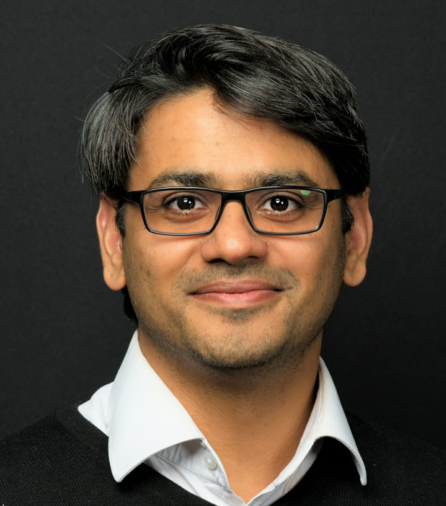

Welcoming Hiten Khambhadia ! Let us walk you through his Expertise.

`Digital Transformation` - Platform setup and Monetization Models, Cloud Native Architecture, Microservices, Agile/DevOps, Cloud Strategy/Assessment

`IT Consultancy` - Definition of operating model for organization, service mgmt setup & review, gap analysis, sourcing models, pricing models, technology and tooling roadmaps, architecture assessment

`Sales` - Customer relationship management, bid management, RFP/RFI

`Delivery` - Account mgmt, large program management, Leading transition, transformation and Outsourcing programs

`Specialties` - Certified in PRINCE 2 Practitioner, ITIL, DSDM, DevOps 

---

**Chief Architect for Banking and Financial Services - TCS**

### Where to find him? 

- Connect him on [LinkedIn](https://www.linkedin.com/in/hiten-khambhadia-2938574/)

WE ARE HAPPY TO HAVE HIM AS A JUDGE IN CODE CAMP 1.0