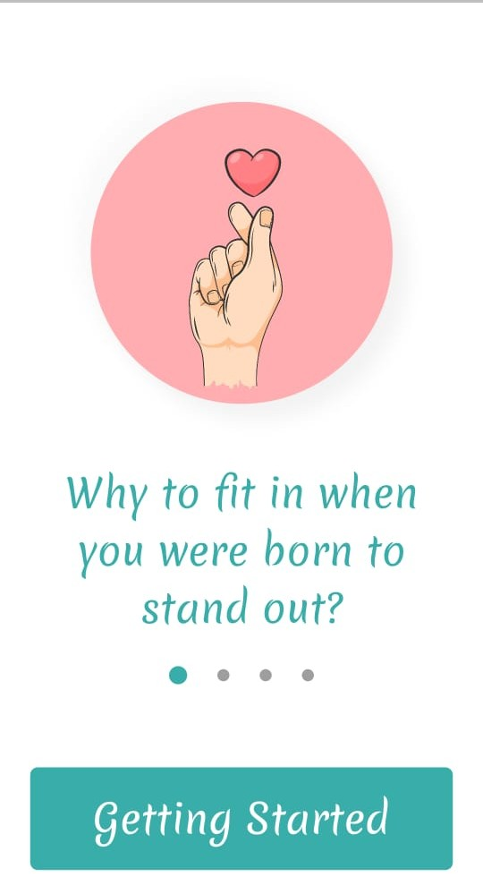

👋 Hello there , we are team Codeplay. We are a couple of first years trying to explore everything and aim to solve real-world problems using technology. We both are ambitious, enthusiastic and positive minded individuals, capable of working within a fast paced and challenging environment. We both want to help bring about the change needed and make a genuine impact using the technology for social good. 

---

# **Foster**

 THEME  : `Empowering Differently Abled` 

 Application-Type : `Android Application` 

---

# Description

> Foster is a technological solution for treatment of ADHD that centres on a smartphone app. 

`Features of our responsive app:`

- User can register using their google account.
- The app provides a Task Planner since organization is a common challenge for adults with ADHD. It plans your tasks, notifies you when you need to start   it and upon completion gives an encouraging message. 
- The app provides a Sleep Tracker which will track your sleep cycle and help you regulate it.
- The app provides a Medication Tracker which will notify and help you so that you never forget to take medications.
- The app has a section where you will know about various yoga asanas and workouts, which are ideal for ADHD, as well as watch its video tutorials.
- You will also get to know to about the superpowers of ADHD so that you are reminded how special you are.

---

---

# Tech Stack

  `Flutter` |  `Firebase` |  `Node.js`

# Project Links

 [GitHub Link](https://github.com/adrikagupta/code-camp_codeplay)  

 [Hosted-Link](https://drive.google.com/file/d/1lT7Q8eNx9kDiIbHh_tPwP4jpD2ZtHJrV/view?usp=drivesdk)  

 [Documentation](https://github.com/adrikagupta/code-camp_codeplay/blob/master/README.md)

---

# Team Members

### `Adrika Gupta`

_**Role-In-Team**_  : Did the frontend of splash screen, swiping screens as well as frontend and backend of Tasks page with notifications and Medicine Tracker with notifications.

_**Working-Stack**_ : `Flutter`  |  `Firebase`  |  `Node.js`

_**University/School**_ : Ramaiah Institute of Technology

### `Gandham Prasanthi`

_**Role-In-Team**_  : Did the frontend of Fitness page and Home Page as well as frontend and backend of Login page and Sleep Schedule page including sleep music.  

_**Working-Stack**_ : `Flutter`  |  `Firebase`

_**University/School**_ : Ramaiah Institute of Technology

